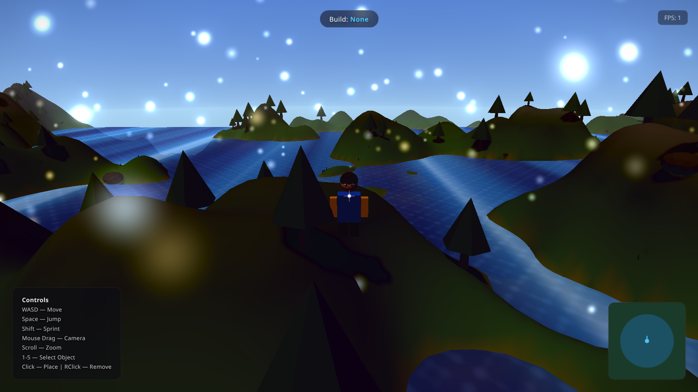
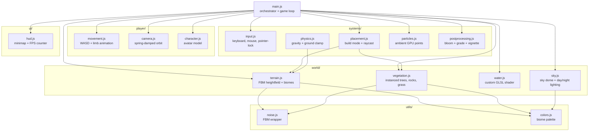

# Sandbox World


<p align="center">
  
</p>

A polished, browser-based 3D sandbox world built with **Three.js** and **Vite**. Procedural terrain, a shader-driven sky with a full day/night cycle, custom GLSL water, instanced vegetation, a placeable-object build mode, and a cinematic post-processing stack — all in a single WebGL canvas with no game engine, no classes, and no external assets.

Designed as a self-contained showcase of real-time graphics techniques: everything you see is generated at runtime from noise functions and hand-written shaders, not loaded from a file.

## ✨ Features

- **Procedural terrain** — a 200×200-unit heightfield displaced by fractal Brownian motion (3 base octaves + 2 detail octaves of simplex noise), painted with eight biomes (deep water → snow) whose boundaries blend through a second noise pass so transitions never look striped.
- **Shader-driven atmospheric sky** — a custom GLSL sky dome computes a zenith/horizon gradient, a real sun disc with glow and atmospheric scatter, and horizon haze for depth.
- **Full day/night cycle** — the sun orbits over a 60-second loop, and `smoothstep` transitions drive three palettes (day → sunset → night) that retint the sky, the directional sun light, the hemisphere ambient light, and the scene fog in lockstep.
- **Custom GLSL water** — six summed sine waves with analytically derived normals, depth-based color, foam on wave crests, Fresnel reflection, a subsurface-scattering approximation, dual specular highlights, and a shimmering caustic layer. Transparent at 82% opacity.
- **Build mode** — press `1`–`5` to select Tree, Rock, House, Lamp, or Fence; a translucent ghost preview tracks the terrain ahead of you, left-click places it, right-click removes the nearest object within 8 units. Placed objects show up as live dots on the minimap.
- **Instanced vegetation** — trees, rocks, and grass patches are drawn with `InstancedMesh` from a seeded PRNG (`seed = 42`), so the world regenerates identically on every load while keeping draw calls low.
- **Animated third-person character** — a built-from-primitives avatar with shoulder/hip-pivoted limbs, a walk cycle with body bob and arm sway, and a frame-rate-independent idle decay with a subtle breathing motion.
- **Spring-damped camera** — a critically-damped spring follows the player; orbit yaw/pitch, scroll-zoom (4–30 units), and a gentle walk-bob sway. Pointer-lock on first click.
- **Cinematic post-processing** — an `EffectComposer` chain of `UnrealBloom` + a custom color-grading shader (warmth, contrast, saturation, shadow lift) + a vignette pass, on top of AgX tone mapping at exposure 1.15 with PCF-soft shadows. Pixel ratio is capped at 2, and the post-FX chain auto-disables on mobile.
- **HUD overlay** — crosshair, build-mode indicator, controls cheat-sheet, a 150×150 canvas minimap with the player marker and a heading arrow, and a live FPS counter.

## 📦 Installation

**Prerequisites:** [Node.js](https://nodejs.org/) 18+ and a WebGL-capable browser (Chrome, Firefox, Edge, or Safari). The app runs entirely client-side.

The Vite application lives in the `sandbox-world/` subdirectory:

```bash
cd sandbox-world
npm install
npm run dev
```

Vite serves the app at `http://localhost:5173/`. Click the canvas to lock the pointer and start exploring.

## 🚀 Usage

Open `http://localhost:5173/` after `npm run dev`. You spawn on procedural terrain at dawn. Within the first minute you will see the sun rise, the sky shift from night-blue through orange sunset to full day, the water animate, and ambient particles drift past.

### Controls

| Input | Action |
|---|---|
| `W` `A` `S` `D` | Move |
| `Space` | Jump |
| `Shift` | Sprint (18 u/s vs. walk 10 u/s) |
| Mouse drag | Orbit camera (pointer-locked) |
| Scroll | Zoom camera (4–30 units) |
| `1`–`5` | Select build object (Tree / Rock / House / Lamp / Fence); press again to deselect |
| Left-click | Place selected object on terrain ahead of you |
| Right-click | Remove nearest placed object within 8 units |

### Build a small scene

Press `3` to select House, walk to a flat clearing, and left-click to drop a house — its ghost preview appears translucent before you commit. Switch to `1` for trees and scatter a grove, then `5` for a fence line. Right-click any object to clear it. The minimap (top-right) plots every placed object as a gold dot.

### Production build

```bash
cd sandbox-world
npm run build
```

Outputs a static, minified bundle to `sandbox-world/dist/`. Serve it with any static host — no server runtime is required.

### Automated smoke test

A Puppeteer script launches headless Chromium with SwiftShader (software WebGL), loads the app, waits four seconds, screenshots to `/tmp/sandbox-final.png`, and reports any console errors or warnings. Browser-automation dependencies live at the repo root:

```bash
npm install
npm run dev
node test-sandbox.mjs
```

Leave the dev server running in a second terminal before launching the test.

## ⚙️ Configuration

There are no environment variables or CLI flags — the project is a static front end with no build-time configuration. Tunable constants live inline in the source for anyone who wants to fork and adjust:

| File | Knob | Default | Effect |
|---|---|---|---|
| `src/world/terrain.js` | `SIZE` / `SEGMENTS` | `200` / `199` | Terrain extent and mesh resolution |
| `src/world/terrain.js` | `WATER_LEVEL` | `2` | Sea-level height; biomes key off it |
| `src/world/sky.js` | `CYCLE_DURATION` | `60` | Seconds for one full day/night loop |
| `src/player/movement.js` | `WALK_SPEED` / `SPRINT_SPEED` | `10` / `18` | Player movement speed (units/sec) |
| `src/systems/physics.js` | `GRAVITY` / `PLAYER_HEIGHT` | `-30` / `1.8` | Fall acceleration and collision offset |
| `src/systems/postprocessing.js` | bloom `strength` / `threshold` | `0.35` / `0.75` | Glow intensity and brightness cutoff |
| `src/systems/particles.js` | `PARTICLE_COUNT` | `300` | Ambient particle count |

## 🧱 Architecture

A single orchestrator (`main.js`) wires up the renderer, scene, camera, and clock, then drives one `requestAnimationFrame` loop that ticks every subsystem per frame. There are no classes, no dependency-injection container, and no event bus — each module owns its state as module-level variables and exports plain `create*()` / `init*()` / `update*()` functions. Modules import their siblings directly.



Per-frame, `main.js` reads input, advances movement and physics, updates the sky and water shaders, ticks particles and placement, refreshes the HUD, then renders through the post-processing composer (falling back to a direct `renderer.render` when composer is unavailable, e.g. on mobile).

| Path | Purpose |
|---|---|
| `sandbox-world/index.html` | HTML shell with HUD markup and module entry |
| `sandbox-world/src/main.js` | Entry point — renderer, scene, init, game loop |
| `sandbox-world/src/world/` | Terrain, sky, water, vegetation generation |
| `sandbox-world/src/player/` | Movement, camera, character model |
| `sandbox-world/src/systems/` | Input, physics, placement, particles, post-processing |
| `sandbox-world/src/ui/` | HUD: minimap, FPS counter, build-mode display |
| `sandbox-world/src/utils/` | FBM noise wrapper and biome color constants |
| `sandbox-world/vite.config.js` | Pre-bundles `three` for dev-server performance |
| `test-sandbox.mjs` | Puppeteer smoke test (headless Chromium + SwiftShader) |

## 🤝 Contributing

This is a personal showcase project. The repository guidelines for code conventions, module patterns, and the testing workflow are documented in [`AGENTS.md`](./AGENTS.md). Feel free to fork and experiment — the inline constants listed in [Configuration](#⚙️-configuration) are the easiest entry points for tweaking the look and feel.

## 📄 License

No license file is present in this repository. Unless one is added, the source is **all rights reserved** by the repository owner and no rights are granted to copy, modify, or redistribute it.
